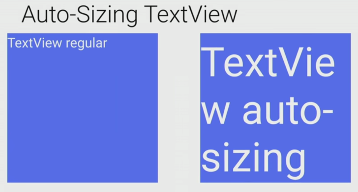

# Auto-Sizing TextViews in Android

Sometimes, we need our ```TextView``` change its text size according to the content put in it. But, Android didn't have much support of it until Android O. And then Android Support library got this feature. Let's see how it all works.

First, you have to add the support library v26 or more in your ```build.gradle``` file.

```groovy
implementation 'com.android.support:appcompat-v7:26.1.0'
implementation 'com.android.support:support-v4:26.1.0'
```

Although, it has been introduced in Android Oreo, but through using support library, this feature is backward compatible upto the Android 4.0 and later. Now, add a ```TextView``` like you normally do.

```xml
<TextView
    android:id="@+id/textView1"
    android:layout_width="match_parent"
    android:layout_height="100dp"
    android:text="Hello Any Small Text Goes Here"/>
```

Now, add this ```app:autoSizeTextType="uniform"``` in your ```TextView```.

```xml
<TextView
    android:id="@+id/textView1"
    android:layout_width="match_parent"
    android:layout_height="100dp"
    app:autoSizeTextType="uniform"
    android:text="Hello Any Small Text Goes Here"/>
```

Now, your ```TextView``` will behave according to the content inside it like this:



You can also do this from Java/Kotlin using this line

```java
TextViewCompat.setAutoSizeTextTypeWithDefaults(myTextView, TextViewCompat.AUTO_SIZE_TEXT_TYPE_UNIFORM);
```

Please note that if you set autosizing in an XML file, it is not recommended to use the value ```"wrap_content"``` for the ```layout_width``` or ```layout_height``` attributes of a ```TextView```. It may produce unexpected results.

That's not it. There are some more options as well. So far, we have only saw the default ```uniform``` auto size text type, but there are two more ways to adjust text size as per our needs:

1. Granularity
2. Preset Sizes

### Granularity
In Granularity, The ```TextView``` can uniformly scale, in a range between the given minimum and maximum size attributes. Each increment takes on the step size specified in the granularity attribute.

In XML, we can do it by adding these lines in our ```TextView```:

```xml
    app:autoSizeMaxTextSize=”100sp” 
    app:autoSizeMinTextSize=”12sp” 
    app:autoSizeStepGranularity=”2sp” 
    app:autoSizeText=”uniform” 
```

Or, in Java/Kotlin, we can do it by calling this method:

```java
TextViewCompat.setAutoSizeTextTypeUniformWithConfiguration(TextView textview, int autoSizeMinTextSize, int autoSizeMaxTextSize, int autoSizeStepGranularity, int unit); 

// Example
TextViewCompat.setAutoSizeTextTypeUniformWithConfiguration(myTextView, 12, 100, 2, TypedValue.COMPLEX_UNIT_SP);
```

### Preset Sizes
By using preset sizes, you can autosize the ```TextView``` from a list of predefined sizes.

In XML, Use the ```autoSizePresetSizesautoSizePresetSizes``` attribute in the layout file.

```xml
    android:autoSizeText=”uniform” 
    android:autoSizePresetSizes=”@array/autosize_text_sizes” 
```

To access the array as a resource, define the array in the ```res/values/arrays.xml``` file.

```xml
<array name=”autosize_text_sizes”> 
    <item>10sp</item> 
    <item>12sp</item> 
    <item>20sp</item> 
    <item>40sp</item> 
    <item>100sp</item> 
</array>
```

Or you can do in Java/Kotlin like this:

```java
TextViewCompat.setAutoSizeTextTypeUniformWithPresetSizes(int[] presetSizes, int unit);

// Example
int[] sizes = getContext().getResources().getIntArray(R.array.autosize_text_sizes)
TextViewCompat.setAutoSizeTextTypeUniformWithPresetSizes(myTextView, sizes, TypedValue.COMPLEX_UNIT_SP);
```
