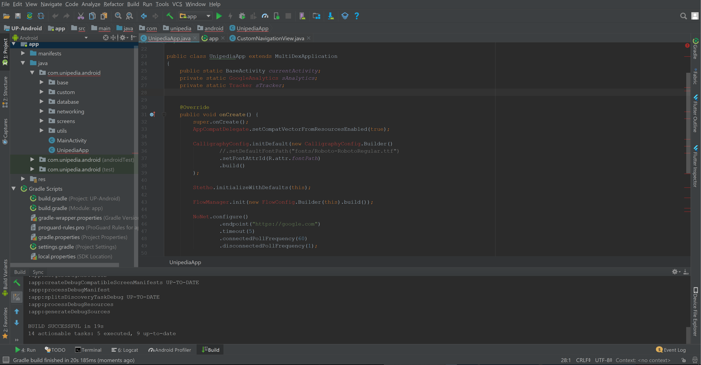

# Lots of Errors in Code but Still App Runs in Android Studio

Today, I opened a very old project for a quick update. After upgrading the support libraries, gradle plugins and other tools, I saw this strange issue for the first time. The app was building and running successfully, but when I opened any code file, I was getting huge list of compile errors mostly about ```Unresolved Reference``` etc.



Initially, I cleaned project, rebuild it, restarted Android studio few times, but couldn't fix it. Heck, I even resumed my coding by ignoring these silly errors, but due to these strange errors, the autocomplete and other IDE functionalities were not working. So, I had to fix this problem. Then I googled it and found some answers on StackOverflow at [here](https://stackoverflow.com/questions/33747250/marked-as-an-error-code-in-android-studio-but-successfully-build-gradle-and-run) and [here](https://stackoverflow.com/questions/48519887/why-does-android-studio-show-errors-in-my-code-but-app-still-runs). 

Most, suggestions were already same what I was doing. What fixed my issue was to delete the ```.idea``` and ```.gradle``` project from the app directory and ```Invalidate and Cache Restart``` the Android Studio and you will be back in the game.
