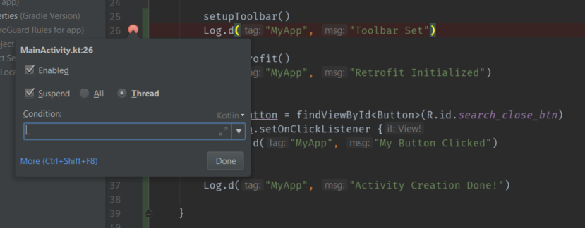
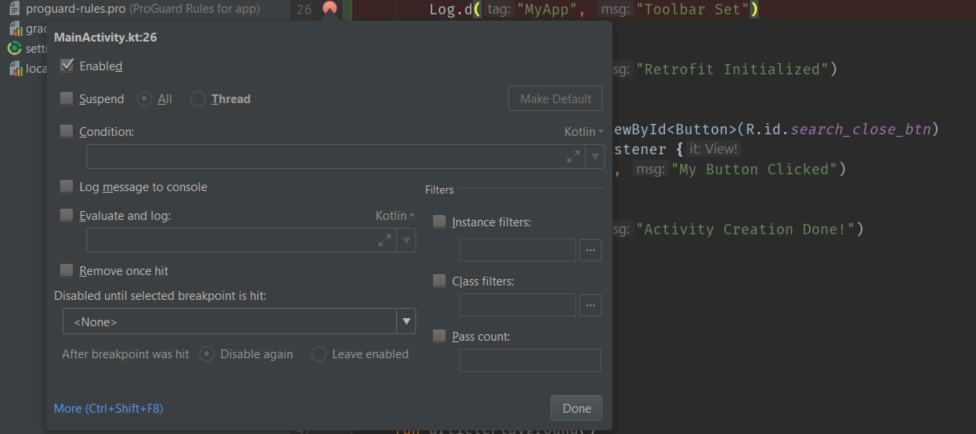
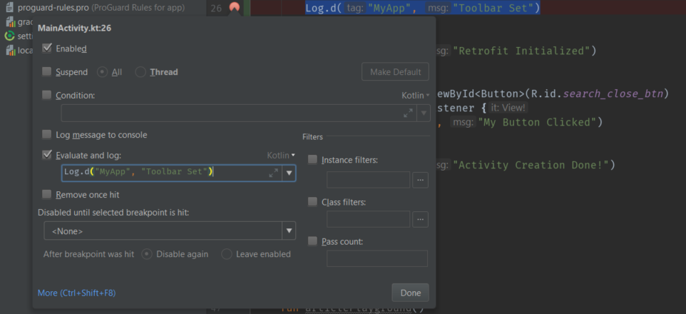

# Add Logs Without Using Code

When debugging apps, we sometimes start putting logging statements all over the code to figure out what’s going on.

```kotlin
class MainActivity : AppCompatActivity() {

    lateinit var retrofit: Retrofit

    override fun onCreate(savedInstanceState: Bundle?) {
        super.onCreate(savedInstanceState)
        setContentView(R.layout.activity_main)

        setupToolbar()
        Log.d("MyApp", "Toolbar Set")

        initRetrofit()
        Log.d("MyApp", "Retrofit Initialized")


        var myButton = findViewById<Button>(R.id.search_close_btn)
        myButton.setOnClickListener {
            Log.d("MyApp", "My Button Clicked")
        }

        Log.d("MyApp", "Activity Creation Done!")

    }
}
```

That works, but it happens that we forget to remove the logs before committing, and they either get flagged in the code review, or they’re still there when we release.

It’s good practice not to leave debug logging statements behind after you’re done debugging, even if you use ProGuard to strip them out, since they have a detrimental impact on the Signal-to-Noise ratio of your codebase. Like comments, logging statements can easily get out of sync with the surrounding code, becoming useless at best, or misleading as worst.

The situation is even more complicated when our logging statements require some conditional checks before being performed. Now you have potentially expensive and useless ```if else```s scattered around as well.

But, it turns out that there a very easy way for this problem. IntelliJ and Android Studio allow you to create non-suspending breakpoints.

First, create any debug breakpoint on any line, either by clicking in the editor gutter, or by using the ```Ctrl-F8``` shortcut. Then, you can edit the breakpoint by either right-clicking it, or by using the ```Ctrl-Shift-F8``` shortcut. and you will see this:



Then, uncheck the ```Suspend``` checkbox, and you will see more options in that modal like this:



Now, add any ```Log``` messages from code to the ```Evaluate and log``` box like this:



And after removing all ```Log``` statements from code and putting in debug breakpoints, your code will look cleaner like this:

```kotlin
class MainActivity : AppCompatActivity() {

    lateinit var retrofit: Retrofit

    override fun onCreate(savedInstanceState: Bundle?) {
        super.onCreate(savedInstanceState)
        setContentView(R.layout.activity_main)

        setupToolbar()
        initRetrofit()
        
        var myButton = findViewById<Button>(R.id.search_close_btn)
        myButton.setOnClickListener {
            
        }

    }
}
```

Much better, right? Now go and use non-suspending breakpoints! All you need to do is run the app with the debugger attached, and the messages will show up in the debug console.
