# Publishing your Android, Kotlin or Java library to jCenter from Android Studio

Few days ago, I launched an Android library called as [Medium
Clap](https://github.com/wajahatkarim3/MediumClap-Android), which allows
developers to create [Medium](https://medium.com/@Medium) clapping effect in
Floating Action Buttons with few lines of the code.

The library went on to be featured in different android newsletters and became
#1 on [Github Trending in
Kotlin](https://github.com/trending/kotlin?since=daily).

[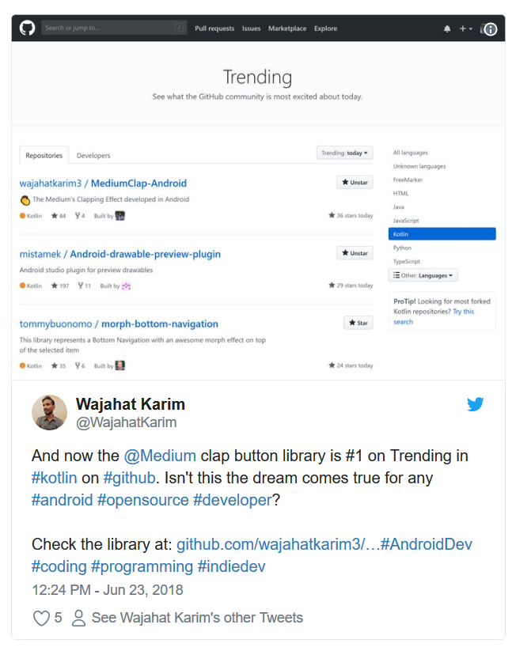](https://twitter.com/WajahatKarim/status/1010423309736038400/)

But, one question which I was being asked over and over again was how to publish
android libraries, especially those written in Kotlin, on jCenter. There are
plenty of different articles around the web on the topic. Some are very
effective and some used to work in past but since the Kotlin came, these aren’t
working anymore.

*****

So, the purpose of this article to present a detailed how-to guide of how I
published [my all android (java and kotlin)
libraries](https://github.com/wajahatkarim3/) on jCenter and how can you do it
as well with in a very easy way. So, let’s get started right away.

### Why jCenter?

There are different platforms for hosting your android libraries such as Maven
Central, or Jetpack. The plus point in choosing jCenter over others is any new
project in Android Studio includes `jCenter` already, so the developers using
your libraries won’t have to add any thing in root `build.gradle` file. All they
have to do is add a simple `implementation` line in their app `build.gradle`
file.

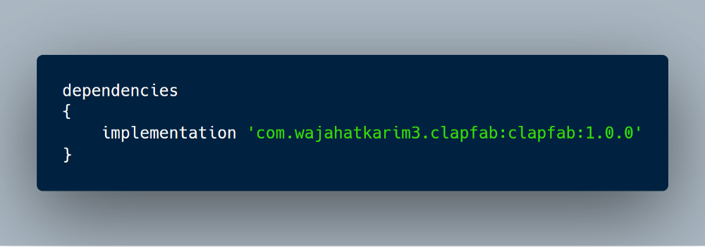

*****

### Sign Up on JFrog Bintray

Since, jCenter is hosted on [JFrog Bintray,](http://bintray.com/) so you will
have to signup there. You can signup with Twitter, Facebook, Github, or by
directly registering your details in it. Click on following to signup on
Bintray.

[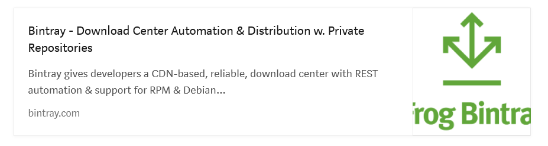](http://bintray.com/)

Once, you are logged in, you will see your dashboard like this:

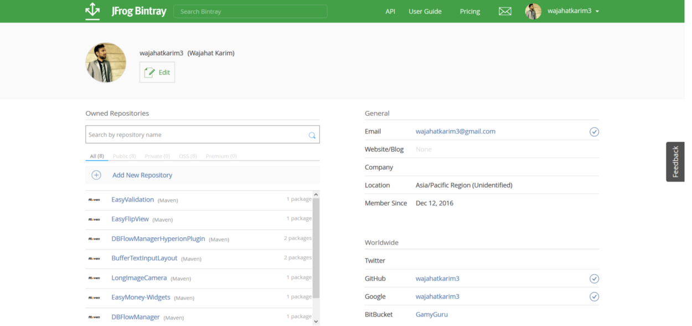

*****

### Creating New Repository

Although there are different ways to add your library code repository in
Bintray. But I do it the in old way by manually creating repository in Bintray.
Click on `Add New Repository` button in your profile dashboard and you will be
presented with a simple form to fill. Add the library name, and choose Type as
Maven. Add your preferred license and description. You can also add avatar or
logo image here as well.

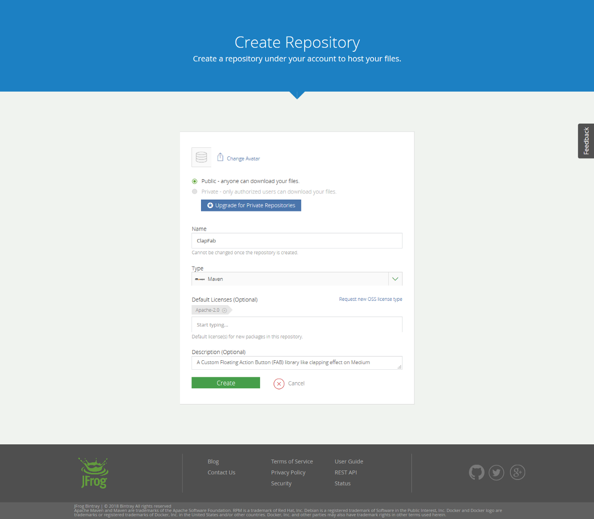

*****

Once you have created the repository, you will redirected to the profile
dashboard. And now you can see your new library in the `Owned Repositories`
list. Click on the title there, and you will be directed to the repository page.

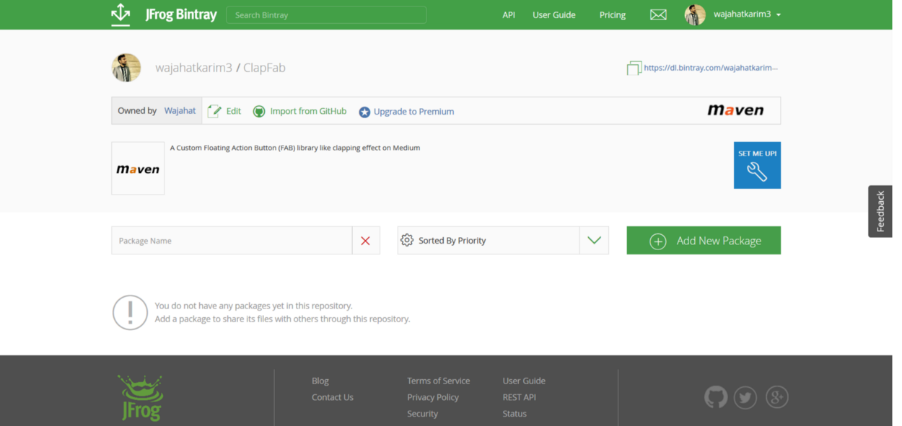

*****

### Adding New Package

So far, we have been through repository. Now, we need to add packages. The
packages in the JFrog Bintray work as `Modules` in the android. So, for example,
if your library has multiple modules, then you add those using multiple packages
as we use the *Support library* packages in android. Or you can use multiple
packages for `debug` and `release` modules. I have recently published an article
about creating different modules for `debug` and `release` as well.

So, now click on the big green `Add New Package` button and you will see a
little long form to fill the details of the module package like this.

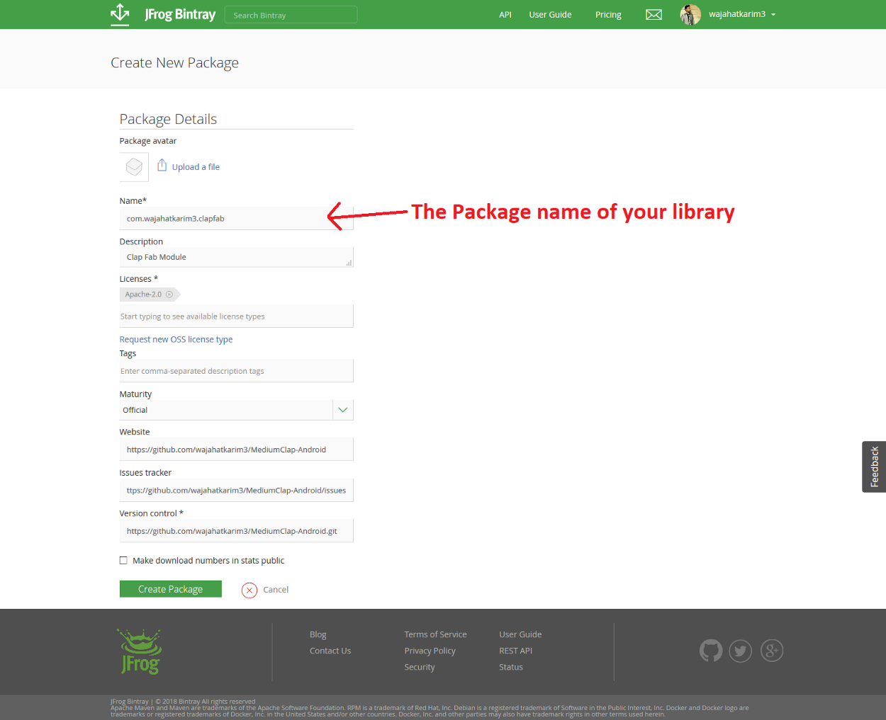

> One important thing to note here is you will have to write your library’s
> package e.g. `com.wajahatkarim3.clapfab`, as the name here. This is very
important and we will explain it in upcoming sections.

After creating the package, go to the repository page. You will see your new
package added in the list.

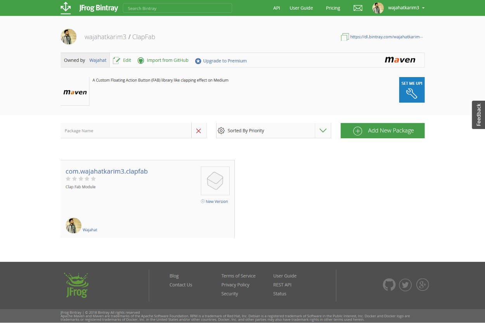

Now, click on the Package name link and you will be directed to the package
details page. Here, you can see lots of details about your package and options
to add new versions and whether your package is available on jCenter etc. I have
highlighted the package name and the maven link in the image. We will discuss
maven link later.

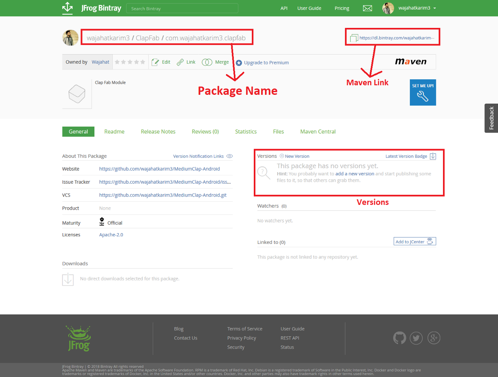

*****

### Adding New Version

Now, after creating the package, our next target is to add versions. In the
previous image, you can see the a box highlighting versions section. Click on
the `New Version` button and you will be directed to a small form like this.

Add the version number in the name field and other option details and click on
`Create Version` button. And after getting redirected to the package details
page, you will now see your version in the `Versions` section like this.

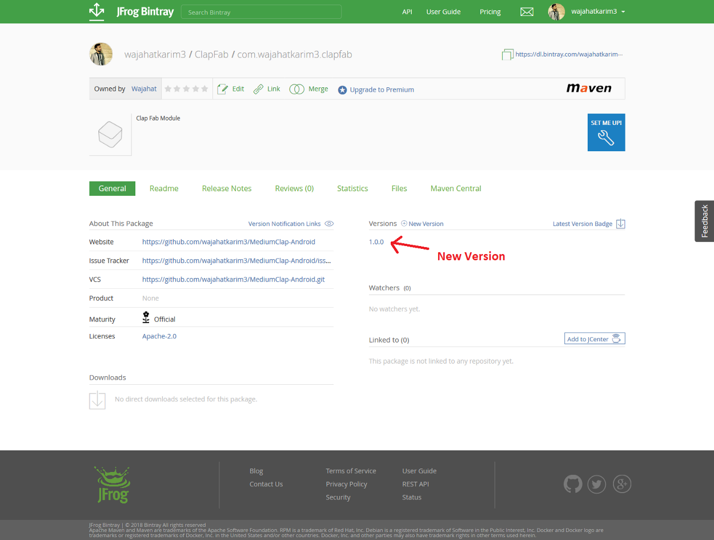

And now we are done with the JFrog Bintray setup. Next, we will upload our
library JAR or AAR on Bintray using Android Studio.

*****

### Configure Your Library in Android Studio

After creation of package and version, now we will add some configurations in
our library module code in Android Studio.

The first step is to add Bintray and Maven plugins in your android project. So,
add these lines in your root` build.gradle` file.

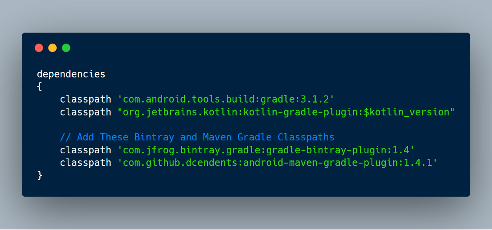

Now, you have to setup your library configs in the library’s` build.gradle`
file. I have commented different lines in the below image to explain it clearly.

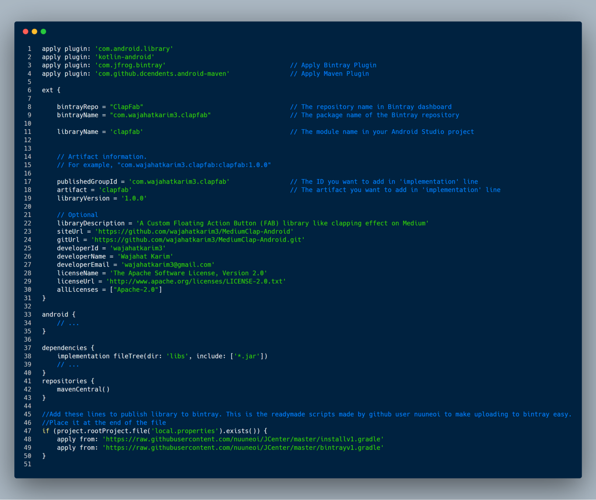

Now, let’s quickly go through these configurations and see what is happening
here.

**Line 2 and 3:** We are applying our Bintray and Maven plugins.

**Line 8 and 9:** We are specifying Bintray repository and package names. You
can see these in the following image.

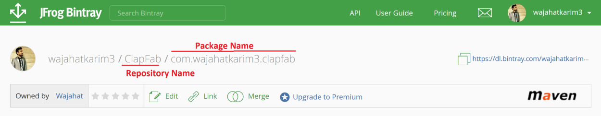

**Line 11:** We are specifying the module name whose AAR/JAR to compile and
upload on Bintray and jCenter.

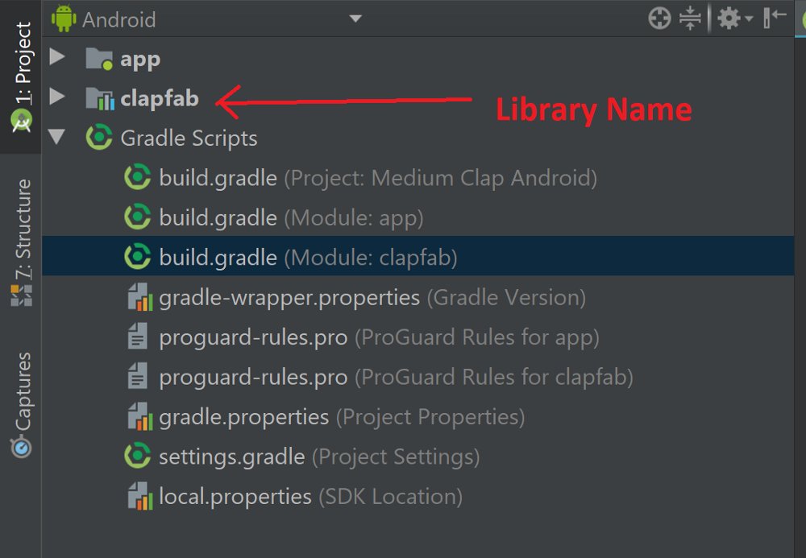

**Line 17, 18, and 19:** These specify the group ID, artifact ID, and version
number respectively. Any library on jCenter is fetched in Android studio using
this structure.

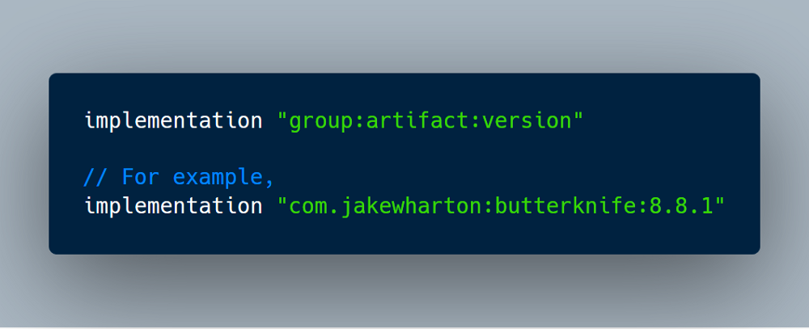

The group is usually the company or developer name. The artifact is the module
or library name. And version is just any number in format of
*major.minor.revision*** **or it can be any other format you find suitable.

**Line 22 to Line 30:** These are the details about the library and are
self-explanatory.

**Line 47:** This is a condition to check whether project has` local.properties`
file or not. If the file is not available, then the uploading task will not
execute.

**Line 48 and 49:** These lines will download the gradle tasks for uploading on
bintray from the specified URLs.

*****

### Adding Bintray API Key

Now, as we have configured our library module, we need to add Bintray API key in
our Android studio project. Since, the API should not be shared publicly, so we
will add it in the` local.properties` file. But, before adding it we need to get
our Bintray API key.

Click on your username on top-right in Bintray dashboard and click on the *Edit
Profile *button. And then click on the **API Key **from the navigation menu.

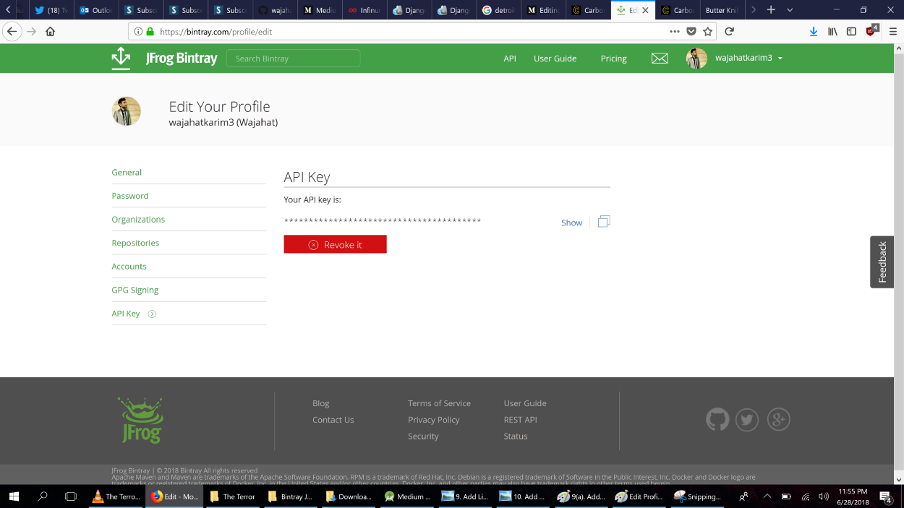

Copy your API key and add these lines in your` local.properties` file.

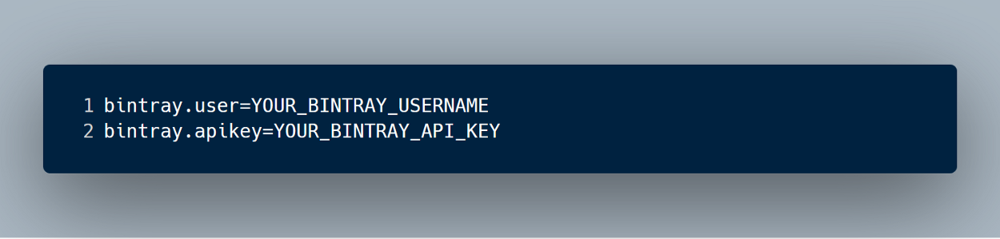

*****

### Compiling The Library Module

After all the configurations and API key setups, it’s time to compile your
module and create AAR/JAR files. You can do it by running this command in
terminal in your project’s root directory.

> If you get any error related to javadoc or see something like the below image,
> then use this workaround. With this workaround, your library methods will not
have the documentation. I haven’t figured out the solution of this issue yet. If
you find it, do let me know in the comments.

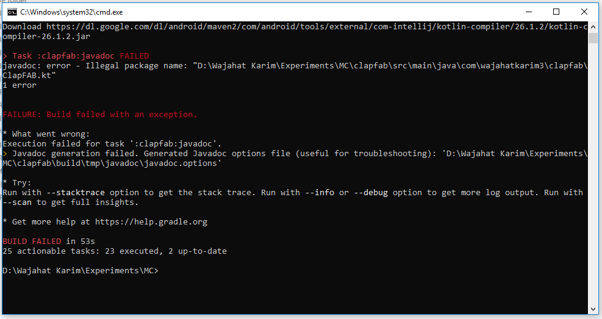

Add these lines in your root` build.gradle` file to solve this javadoc issue.

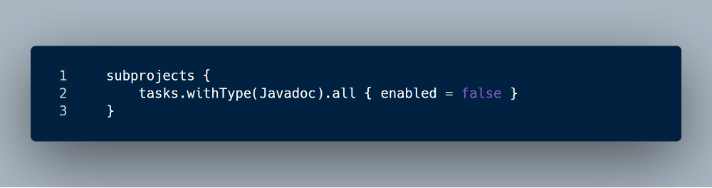

And now when you run the same` gradlew install` command, then you will see a
*Build Successful* message like this.

Now your library is ready to be uploaded on Bintray.

*****

### Uploading Library AAR/JAR on Bintray

Now after successful build, its time to upload your library on Bintray. We can
do it by running this command in same terminal.

After successful run of the command, you will see a *Build Successful *message
like this.

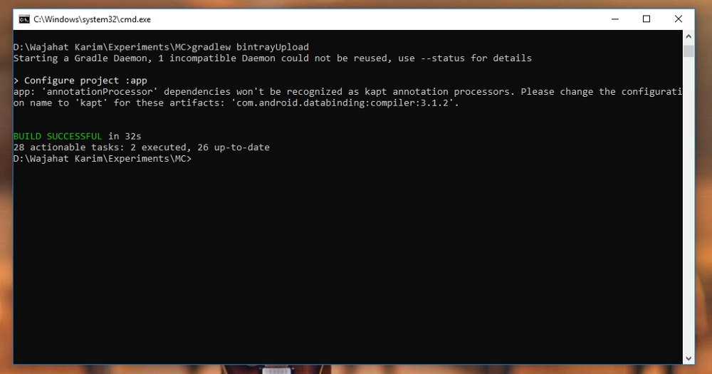

Your AAR/JAR files are uploaded on Bintray now. You can check this in the
version details of repository package in Bintray dashboard.

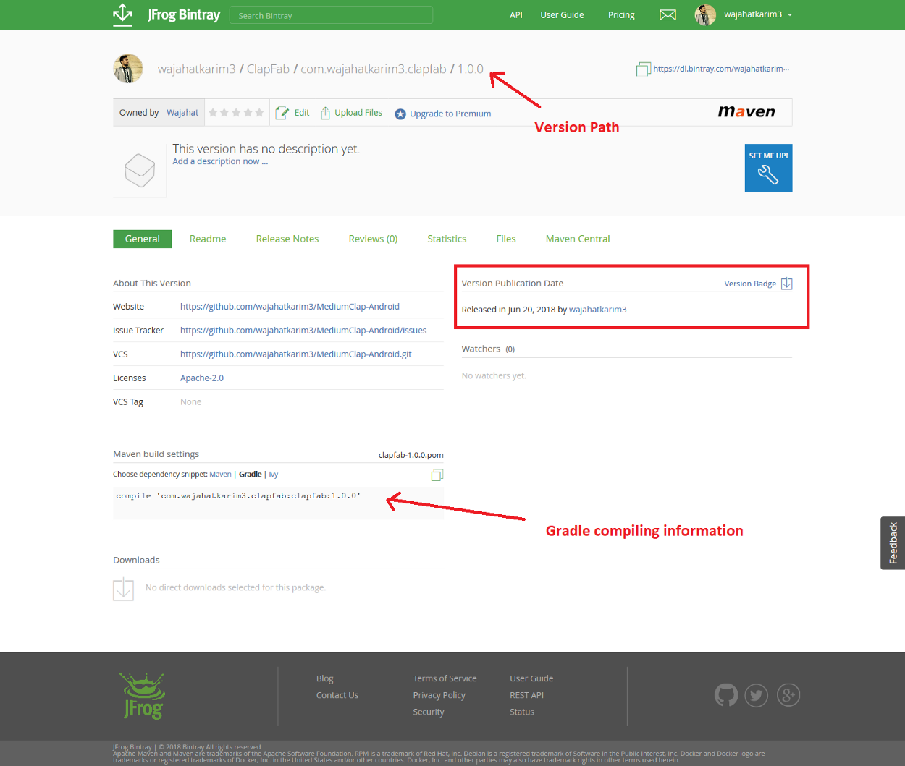

*****

### Submitting Your Package to jCenter

Once your library is uploaded on Bintray, you can use it using your custom maven
link. To use it directly from jCenter, you need to submit it to jCenter for
approval. You only have to do this procedure only one time. The approval can
take few hours to 2–3 days time. You can submit it from your package details in
Bintray dashboard like the image below.

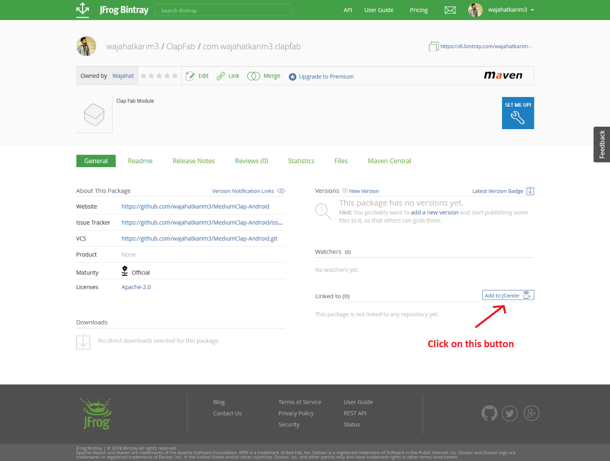

Click on the **Add to jCenter **button and you will be directed to compose a new
message. Add your library description in the message and click on **Send**. Now
after approval, you will get an email and a message on Bintray dashboard to let
you know about the approval. And then you will see a badge of jCenter in your
Package details page.

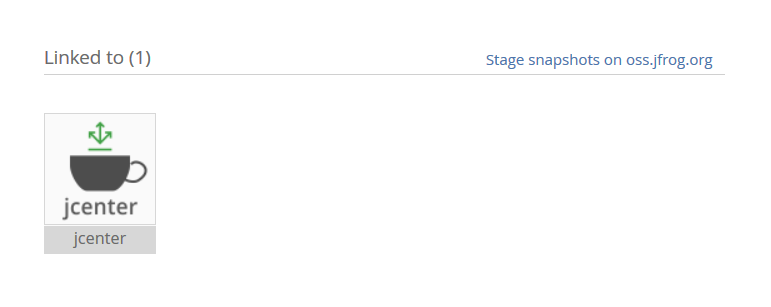

*****

### Your Library is Ready

And now your library can be used through jCenter and using gradle implementation
like like this.

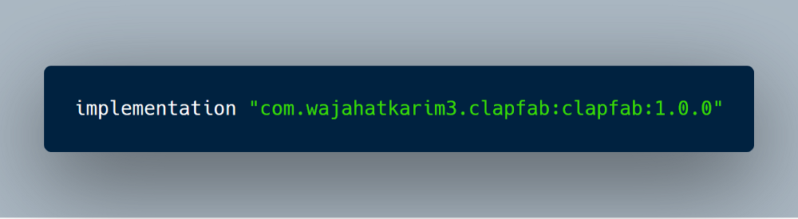
